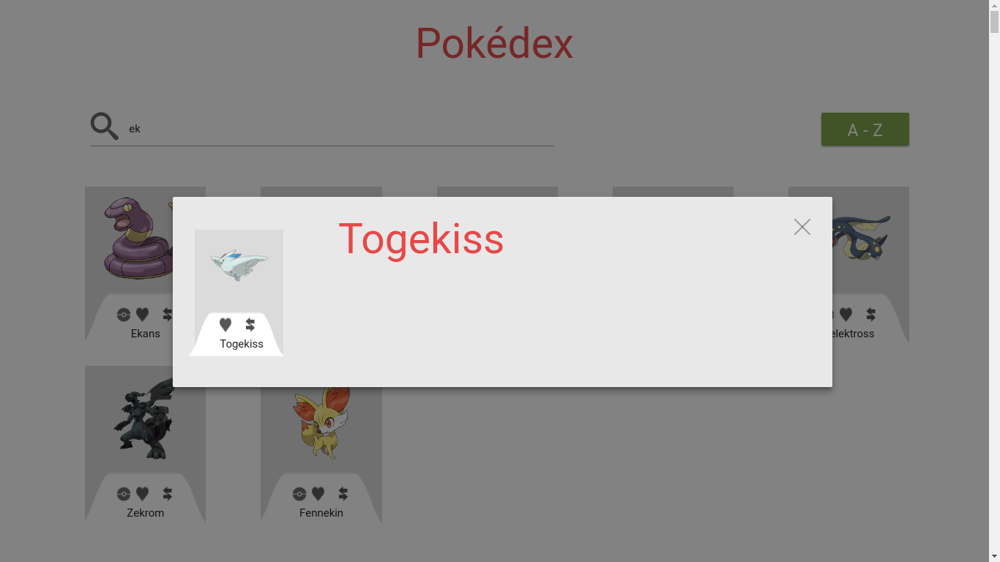

# S42-Pokedex

Objetivo: Desarrollar una pagina que muestre a los distintos Pokemones que tiene la pokeApi en la cual le permita al usuario filtrar por nombre de pokemon y que al hacer clik en la pokeball muestre un modal con los detalles del pokemon.

